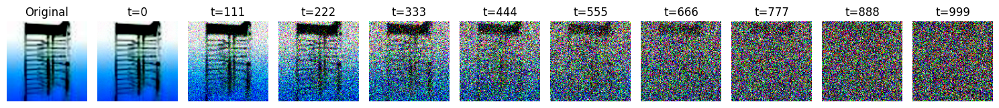
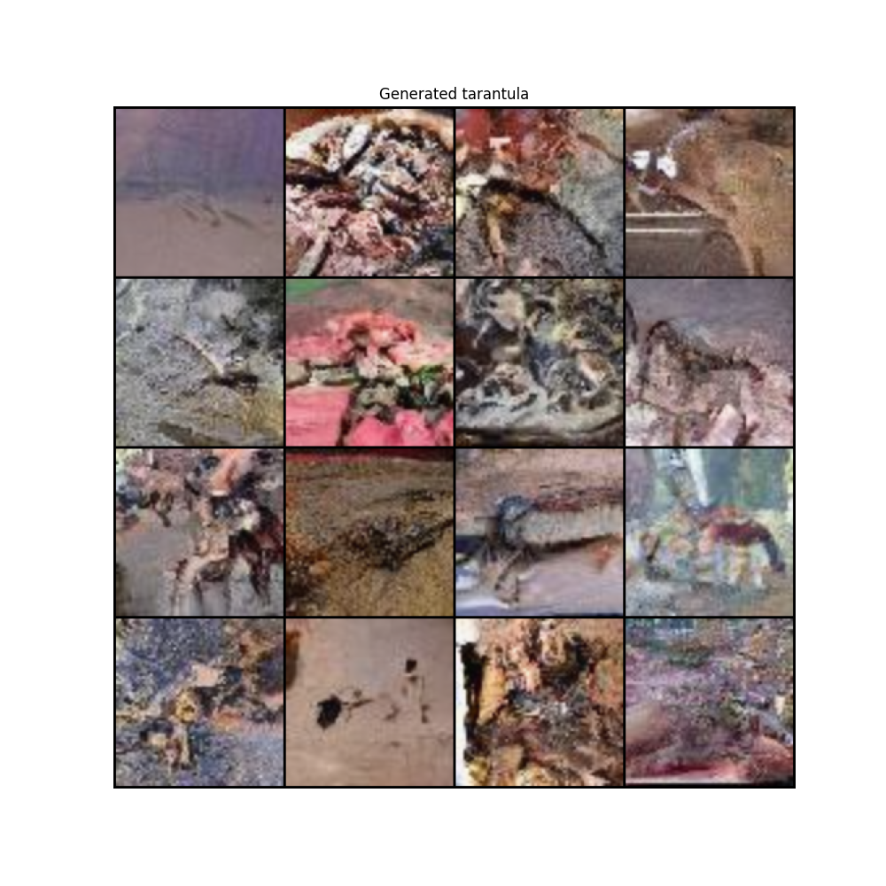
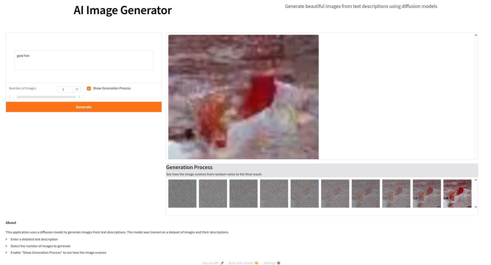

<h1 align="center">
Diffusion Model
</h1>

<p align="center">
  
</p>

<p align="center">
  A powerful conditional diffusion model for image generation from text descriptions.
</p>

<p align="center">
    <a href="https://www.python.org/">
    
  </a>
  <a href="https://pytorch.org/">
    
  </a>
  <a href="https://www.gradio.app/">
    
  </a>
</p>

---

## Overview

This project implements a conditional diffusion model that generates images from text descriptions. The model learns to gradually denoise random Gaussian noise into coherent images, guided by text prompts.

<p align="center">
  
</p>

## Key Features

- **Text-to-Image Generation**: Convert textual descriptions into high-quality images
- **Web Interface**: User-friendly interface for image generation
- **Conditional Generation**: Fine-grained control over generated content
- **Interactive Process Visualization**: Watch the denoising process in real-time
- **Multi-Class Support**: Generate images across various categories

## Architecture

The model consists of several key components:

```
├── models/
│   ├── modules.py        # Neural network building blocks
│   ├── text_encoder.py   # Text embedding module
│   ├── time_encoder.py   # Timestep encoding module
│   └── unet.py           # Conditional UNet architecture
│
├── output_ImageNet/      # Generated outputs and visualizations
│
├── diffusion.py          # Core diffusion model implementation
├── plot_func.py          # Visualization utilities
├── preprocess.py         # Data loading and preprocessing
└── web.py                # Web interface for image generation
```

<p align="center">
  
</p>

## Web Interface

The project includes a sleek web interface for easy interaction with the model:

<p align="center">
  
</p>

Features:
- Text prompt input
- Multiple image generation
- Process visualization
- Real-time generation progress

## Getting Started

1. **Clone the Repository:**
   ```bash
   git clone https://github.com/yourusername/conditional-diffusion.git
   cd conditional-diffusion
   ```

2. **Install Dependencies:**
   ```bash
   pip install torch torchvision sentence-transformers gradio
   ```

3. **Launch the Web Interface:**
   ```bash
   python web.py
   ```

## Model Components

### 1. Diffusion Process
- Forward diffusion adds noise gradually
- Reverse diffusion learns to remove noise
- Conditional generation guided by text embeddings

### 2. Architecture Details
- UNet backbone with skip connections
- Text conditioning through cross-attention
- Time embedding using sinusoidal positions
- Batch normalization for stable training

### 3. Dataset
- [Tiny ImageNet](https://paperswithcode.com/dataset/tiny-imagenet), over 1Million images and 200 classes

### 3. Training Process
- Dataset: ImageNet subset
- Text embeddings: SentenceTransformer
- Loss: MSE between predicted and actual noise
- Optimizer: AdamW with gradient scaling

## Sample Generations

Generate images from text descriptions like:
- "red apple"
- "golden retriever"
- "sunset over mountains"

## License

This project is licensed under the MIT License - see the [LICENSE](LICENSE) file for details.

---