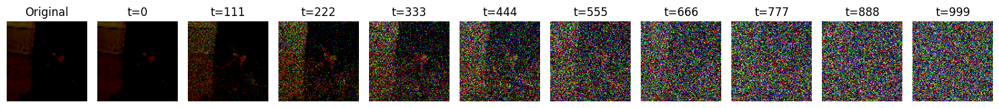

# Diffusion Model

A text-to-image diffusion model that generates realistic images from text descriptions.



## Overview

This project implements a conditional diffusion model that can generate images based on text prompts. The model is trained on the ImageNet dataset and can create a variety of images from simple text descriptions.

## Features

- 🖼️ **Text-to-Image Generation**: Create images from text descriptions
- 🔄 **Diffusion Process**: Implementation of forward and reverse diffusion
- 🌐 **Web Interface**: Interactive UI for generating and visualizing images
- 📊 **Visualization Tools**: Tools to visualize the diffusion process

## Examples

### Image Generation Process

Watch how the model gradually transforms random noise into a coherent image:


### Sample Generations

The model can generate various classes of images:


## Project Structure

```
├── models/                # Model architecture
│   ├── modules.py         # Basic building blocks
│   ├── text_encoder.py    # Text embedding functions
│   ├── time_encoder.py    # Timestep embedding
│   └── unet.py            # Conditional UNet architecture
├── output_ImageNet/       # Generated outputs
├── diffusion.py           # Core diffusion logic
├── plot_func.py           # Visualization utilities
├── preprocess.py          # Data preprocessing
└── web.py                 # Web interface
```

## How It Works

1. **Forward Diffusion**: Gradually adds noise to images according to a schedule
2. **Training**: Model learns to predict and remove noise at each timestep
3. **Sampling**: Generate new images by starting with random noise and iteratively denoising

## Web Interface

Launch the web interface to interact with the model:

```bash
python web.py
```

Features:
- Enter text descriptions to generate images
- Control the number of generated samples
- View the step-by-step generation process

## Technical Details

- **Architecture**: Conditional UNet with timestep and text embeddings
- **Text Encoding**: Sentence transformers for text embeddings
- **Training**: Trained on ImageNet dataset with a diffusion process of 1000 timesteps
- **Visualization**: Matplotlib and custom plotting functions for process visualization

## Requirements

- PyTorch
- Torchvision
- Sentence Transformers
- Gradio
- Matplotlib
- NumPy
- tqdm

## Getting Started

1. Clone the repository
2. Install dependencies: `pip install -r requirements.txt`
3. Run the web interface: `python web.py`
4. Enter text prompts and generate images

## Training

To train the model on your own dataset:

```bash
python diffusion.py
```

The training process will save model checkpoints and visualizations to the `output_ImageNet` directory.